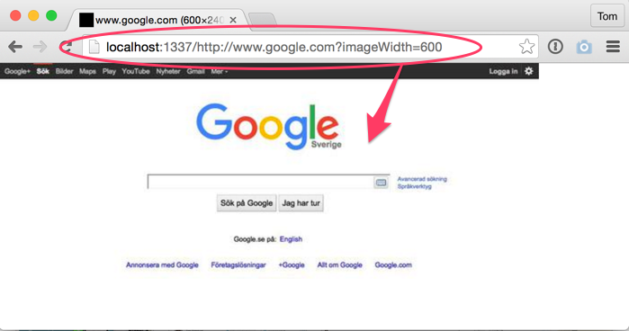

# Screenshooter

Generates a screenshot of any web page - as API or command line. Powered by [Puppeteer](https://github.com/GoogleChrome/puppeteer).

Made by the team at **Weld** ([www.weld.io](https://www.weld.io?utm_source=github-screenshooter)), the code-free app and web creation tool:

## Screenshot

## How to run it

1. Install dependencies: `yarn`
2. Start Screenshooter with `yarn start`

## How to use it

Browser: Open your favorite browser and take a screenshot like this: `http://localhost:1337/http://ljugare.com`

Embed a screenshot directly into an HTML `img` tag:

	

Command line:

	node shoot.js http://ljugare.com myimage.jpg imageWidth=500 imageHeight=400

### Parameters

E.g. `http://localhost:1337/http://ljugare.com?imageFormat=png`

* imageFormat: (default: 'jpg')
* imageWidth (default: 240)
* imageHeight (default: 240)
* browserWidth (default: 1024)
* browserHeight (default: 1024)
